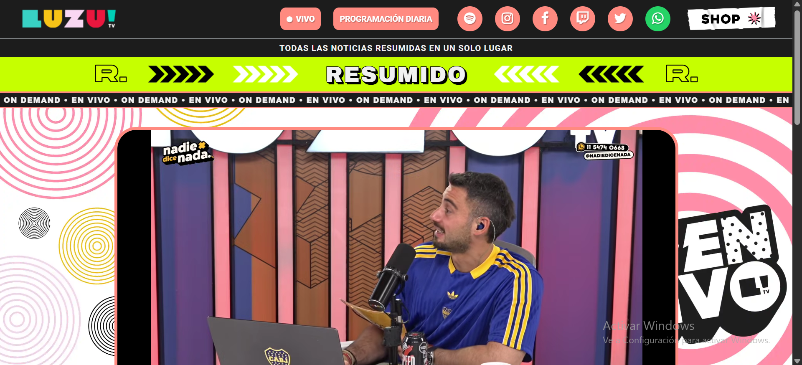
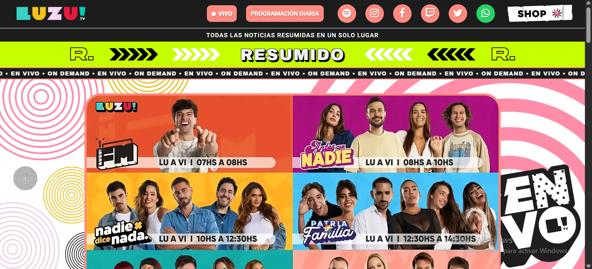
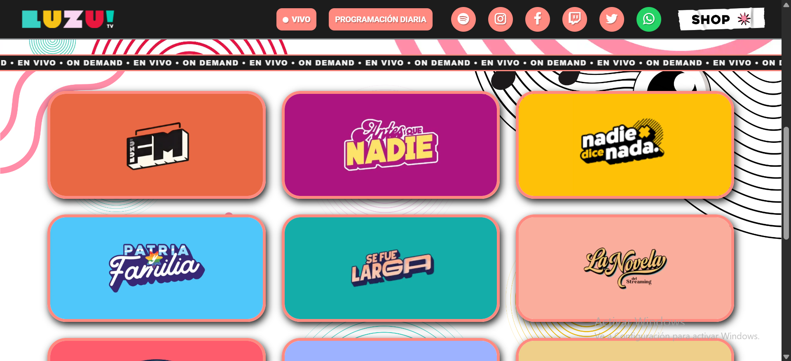
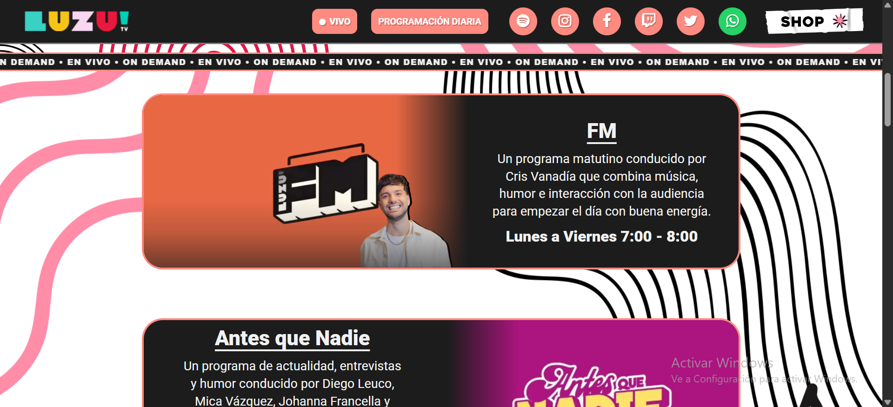
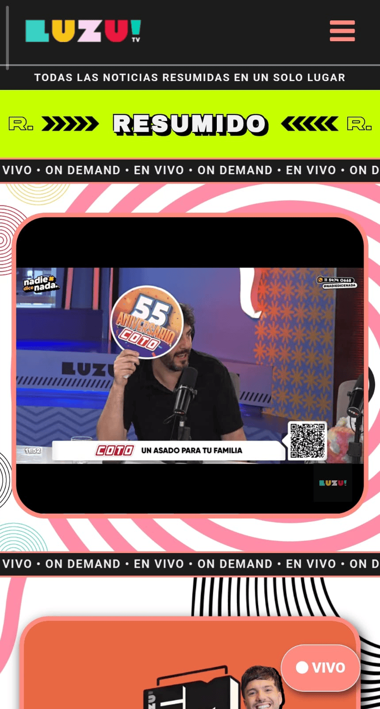
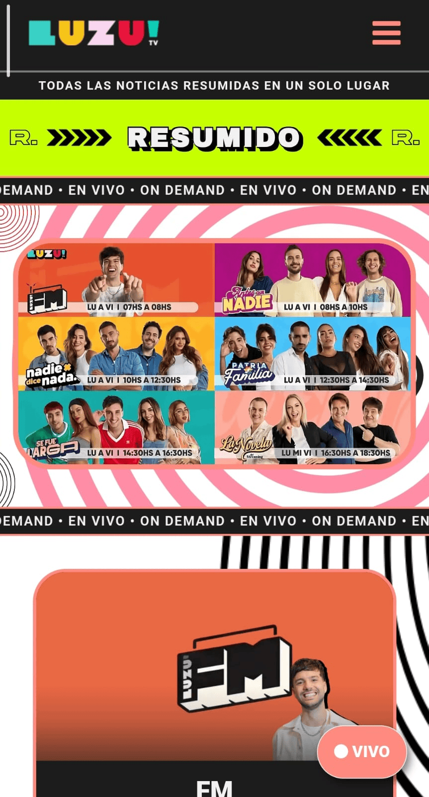
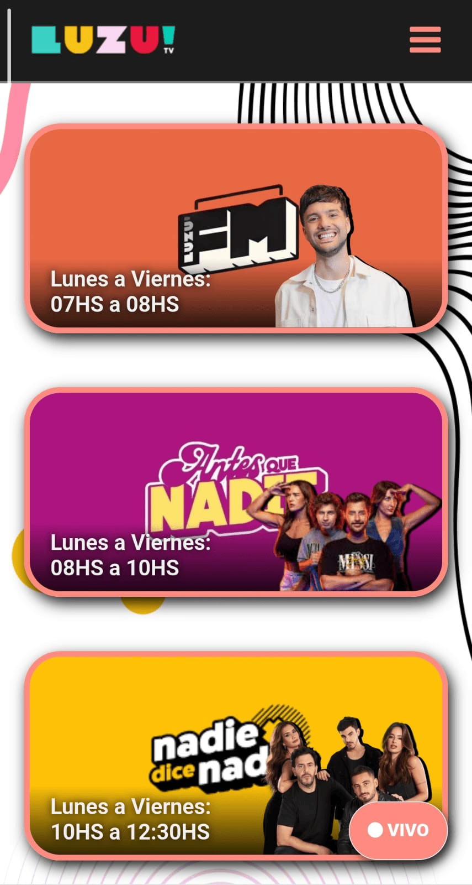
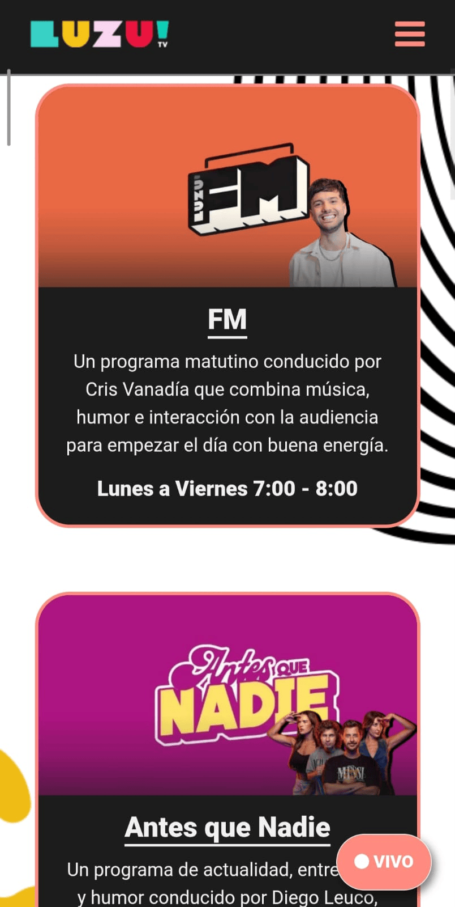

# Proyecto: Rediseño Web LuzuTV

## Introducción
Este proyecto es una página web no oficial inspirada en LuzuTV, desarrollada con el objetivo de modernizar su diseño, mejorar la experiencia del usuario y optimizar el rendimiento en todos los dispositivos. El proyecto ya se encuentra finalizado y completamente funcional.

## Objetivos del proyecto
- Modernizar el diseño para hacerlo atractivo y completamente responsivo.
- Optimizar la velocidad de carga y el rendimiento.
- Mejorar la estructura y organización del contenido para facilitar la navegación.
- Incorporar enlaces a redes sociales importantes: Instagram, YouTube, Twitch, TikTok, Twitter, Spotify.

## Proceso de rediseño

### Etapa 1: Análisis inicial
- [x] Revisar la página original.
- [x] Identificar problemas y áreas de mejora.

### Etapa 2: Diseño y maquetación
- [x] Crear estructura base en HTML semántico.
- [x] Aplicar estilos CSS modernos y responsivos (Flexbox, Grid, Media Queries).
- [x] Integrar Google Fonts y Font Awesome para tipografía e iconos.
- [x] Realizar pruebas de responsividad en móviles, tabletas y escritorio.

### Etapa 3: Implementación de funcionalidades
- [x] Añadir interactividad con JavaScript (menú hamburguesa, botones dinámicos).
- [x] Mejorar accesibilidad con atributos `aria-label` y roles adecuados.
- [x] Optimizar SEO mediante meta tags y Open Graph.

### Etapa 4: Pruebas y ajustes
- [x] Verificar compatibilidad entre navegadores modernos.
- [x] Realizar pruebas de usabilidad y accesibilidad.
- [x] Optimizar tiempos de carga y rendimiento.

## Resultados finales
- Página web moderna, atractiva y totalmente responsiva.
- Navegación clara, intuitiva y accesible para todos los usuarios.
- Experiencia de usuario mejorada con enlaces sociales visibles y funcionalidad completa.
- Rendimiento optimizado para todos los dispositivos.

## Tecnologías utilizadas
- HTML5 semántico
- CSS3 (Flexbox, Grid, Media Queries)
- JavaScript ES6+
- Google Fonts
- Font Awesome

## Enlaces útiles
- Página original: [https://luzutv.com.ar/](https://luzutv.com.ar/)
- Documentación Font Awesome: [https://fontawesome.com/v4.7.0/](https://fontawesome.com/v4.7.0/)
- Google Fonts: [https://fonts.google.com/](https://fonts.google.com/)

## Capturas de pantalla del proyecto - vista Desktop
### Página de inicio

### Página de inicio - Programación diaria

### Página de inicio - Contenido (Galería)

### Programación diaria - Contenido (Grilla de programas)

## Capturas de pantalla del proyecto - vista Mobile
### Página de inicio

### Página de inicio - Programación diaria

### Menú hamburguesa

### Página de inicio - Contenido (Galería)

### Programación diaria - Contenido (Grilla de programas)

