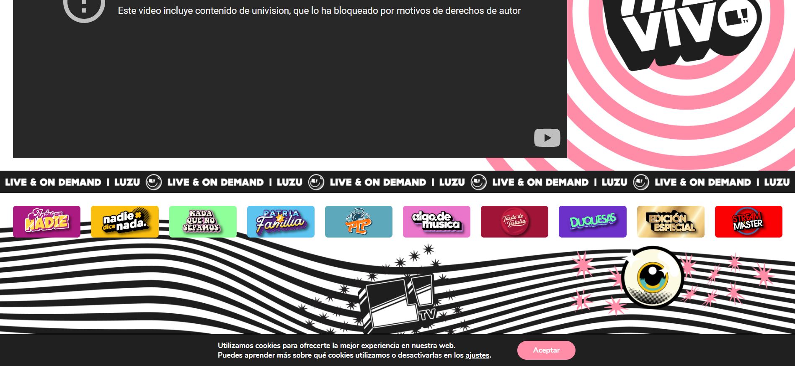

# Proyecto: Rediseño Web LuzuTV

## Introducción
- **Página actual**: [Google](https://luzutv.com.ar/)
- **Proposito del rediseño**: Mejorar el diseño, experiencia del usuario, rendimiento, mejorar el diseño responsivo para adaptar a diferentes dispositivos y modificaciones varias.

## Objetivos del proyecto
- Modernizar el diseño para que sea atractivo y responsivo.
- Optimizar la velocidad de carga.
- Mejorar la estructura del contenido para facilitar la navegación.
- Incorporar nuevas funcionalidades como enlaces a Instagram, Youtube, Twich, TikTok, Twitter, Spotify.

## Estado inicial de la página
- Diseño desactualizado.
- Navegación poco intuitiva.
- Falta de accesibilidad (etiquetas, contrastes, etc.).

## Proceso de rediseño

### Etapa 1: Análisis inicial
- [x] Revisar la página actual.
- [x] Identificar problemas y áreas de mejora.

### Etapa 2: Diseño y maquetación
- [ ] Crear una estructura base en HTML.
- [ ] Aplicar estilos con CSS.
- [ ] Hacer pruebas de responsividad (móviles, tabletas, escritorio).

### Etapa 3: Implementación de funcionalidades
- [ ] Añadir interactividad con JavaScript.

### Etapa 4: Pruebas y ajustes
- [ ] Comprobar compatibilidad en navegadores.
- [ ] Realizar pruebas de usabilidad.
- [ ] Optimizar tiempos de carga.

## Resultados esperados
- Una página moderna y responsiva.
- Mejor experiencia de usuario.
- Mayor interacción y satisfacción de los usuarios.

## Tecnologías utilizadas
- HTML5
- CSS3
- JavaScript
- Bootstrap

## Enlaces útiles

## Captura de progreso

## Captura de la web original

